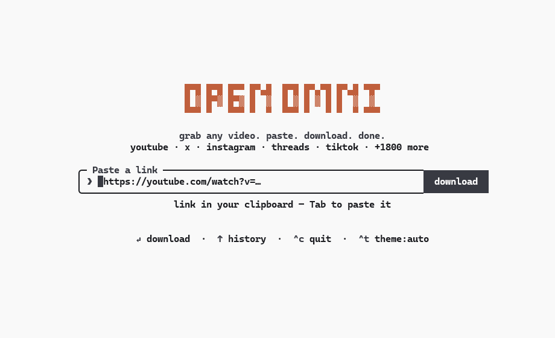
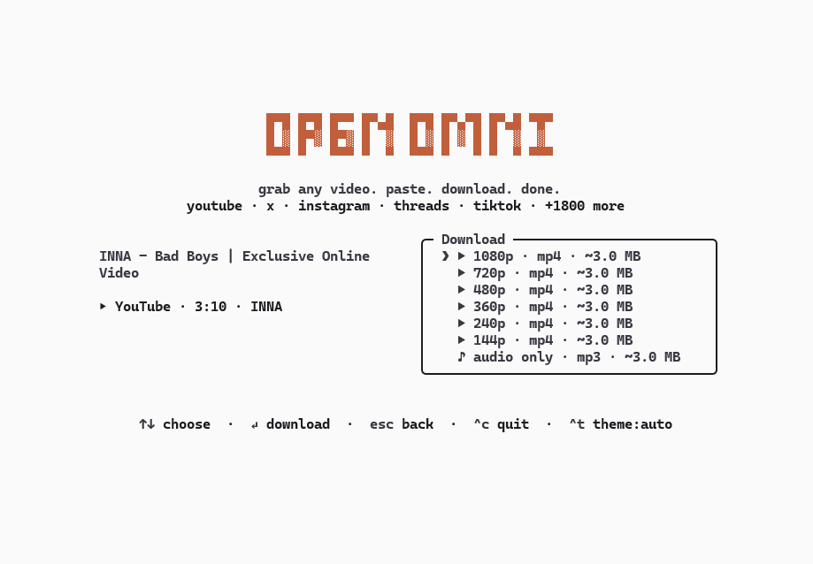

<p align="center">
  <picture>
    <source media="(prefers-color-scheme: dark)" srcset="assets/logo-dark.svg">
    
  </picture>
</p>

<p align="center">
  grab any video. paste. download. done.
</p>

Download videos from YouTube, X/Twitter, Instagram, Threads, TikTok and
1,800+ other sites — right from your terminal. Paste a url, pick a
resolution (or audio-only mp3), done. No popups, no fake download buttons,
no sketchy redirects.



## Install

```sh
npm install -g open-omni
```

Or try it without installing anything:

```sh
npx open-omni
```

Requires Node 18+. Everything else (yt-dlp, ffmpeg) is fetched or bundled
automatically.

## Usage

```sh
$ open-omni https://youtu.be/dQw4w9WgXcQ             # straight to the format picker
$ open-omni https://youtu.be/dQw4w9WgXcQ --best      # skip picker, download highest resolution
$ open-omni https://youtu.be/dQw4w9WgXcQ --mp3       # skip picker, extract audio only
$ open-omni https://youtu.be/dQw4w9WgXcQ -o ~/Videos # download to custom folder
$ open-omni                                          # prompts for a url (or Tab pastes from clipboard)
$ open-omni --theme light                            # force the light palette
```

Open Omni takes over the terminal (full-screen, centered — and restores your
scrollback on exit). Pick a format with ↑/↓ (or j/k, or number keys) and
hit enter. `esc` goes back, `^c` quits. Or just use the mouse — the download
button, the format list and the footer hints are all clickable, and
clicking the logo takes you back home. Files are saved to `~/Downloads` by default
(or the directory specified via `-o <dir>`, `--output <dir>`, or `$OPEN_OMNI_DIR`),
and the file path is printed to your terminal when you're done.

The default `auto` theme uses your terminal's own foreground and background,
so it follows light and dark terminal themes without guessing. Press `^t` or
click the theme control in the footer to cycle through `auto`, `light`, and
`dark` for the current session. Use `--theme auto`, `--theme light`, or
`--theme dark` to choose the starting theme for one launch.



## How it works

- Powered by [yt-dlp](https://github.com/yt-dlp/yt-dlp). On first run,
  Open Omni downloads the standalone yt-dlp binary to `~/.open-omni/bin` —
  no Python required. If you already have yt-dlp installed, it uses yours.
  Keep it up-to-date with `open-omni -U` (or `open-omni --update-ytdlp`).
- ffmpeg (needed for merging high-res streams and mp3 extraction) is found
  on your PATH, with `ffmpeg-static` as a bundled fallback.
- The UI is [Ink](https://github.com/vadimdemedes/ink) — React for the
  terminal.

## Development

```sh
npm install
npm run build        # bundle to dist/ with tsup
npm run dev          # rebuild on change
node dist/cli.js <url>
npm run typecheck
```

To try it as a global command without publishing: `npm link`, then run
`open-omni` anywhere.

## Roadmap

- [x] `--best` / `--mp3` flags to skip the picker (scriptable mode)
- [x] `-o <dir>` to choose the output folder
- [x] Playlist / thread-with-multiple-videos support
- [x] Clipboard detection: launch bare and auto-suggest the url you copied
- [x] Self-update for the bundled yt-dlp binary (`yt-dlp -U`)
- [ ] Publish to npm (`npm i -g open-omni` / `npx open-omni`)
- [ ] `curl open-omni.sh | sh` installer

## A note on fair use

Open Omni is a personal-archiving tool. Downloading content may violate a
platform's terms of service — only download what you have the right to
keep, and be excellent to creators.

## License

[MIT](LICENSE)
